# Intro to HTML & CSS

### Environment

For this workshop, we'll use a simplified web development environment, [JS Bin](http://jsbin.indetermi.net:3000). This site allows web developers to create and experiment
with simple web pages in an easy online environment. You'll edit HTML and CSS code directly on the site, and your web page will be rendered (displayed) live
in the same window. It's the easiest way to get started.

### Review of CodeAcademy's HTML & CSS course

HTML
- Glossary: http://www.codecademy.com/glossary/html
- "Hypertext Markup Language"
- Adds structure and meaning to content
- In principle, a person should be able to understand the structure and meaning of your web page without being able to see it.

```html
    <title>Access Code 2.1</title>
```

CSS
- Glossary: http://www.codecademy.com/glossary/css
- "Cascading Style Sheets"
- Adds style to the page
- Multiple selectors can target the same HTML; precedence rules decide which selector is applied.

```css
title {
    color: red;
}
```

### A Word on Style

Programmers can be religious about style. Rather than bore you with the details, I'd like you to just follow these formatting conventions:

Good HTML:
```html
<html>
    <head></head>
    <body>
        <p>Some text</p>
        
        <div class="stuff">
            <p>Some more text</p>
        </div>
    </body>
</html>
```

Bad HTML:
```html
<html>
    <head></head>
        <body>
        <p>Some text</p>
            
        <div class="stuff">
            <p>Some more text</p>
    </div>
    </body>
</html>

```

Good CSS:
```css
#someId {
    background: blue;
}
#anotherId,
.someClass {
    width: 100px;
}
```

Bad CSS:
```css
#someId {
    background:blue;
}


#anotherId,
.someClass {
  width: 100px;
}
```

*Consistency is key.*

### Box Model (padding and margins)

HTML tags can be thought of as boxes. This is called the "box model", and it consists of: `margin`, `border`, `padding`, and the actual content. The three previous properties can be suffixed with `-top`, `-bottom`, `-left`, and `-right` in order to target only one side of the box. For example:

```css
div {
    margin-top: 20px;
}
```

**Margin**
- Separates a block from things outside of it

**Padding**
- Separates contents away from the edges of its block

**Border**
- The edge of the content

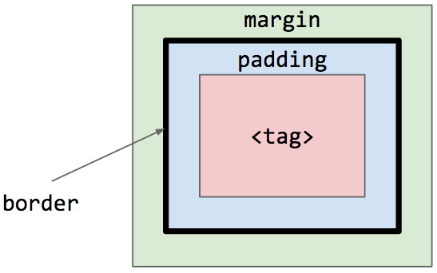

> **Exercise:** Use the `padding` and `margin` properties to recreate the image below:
>
> 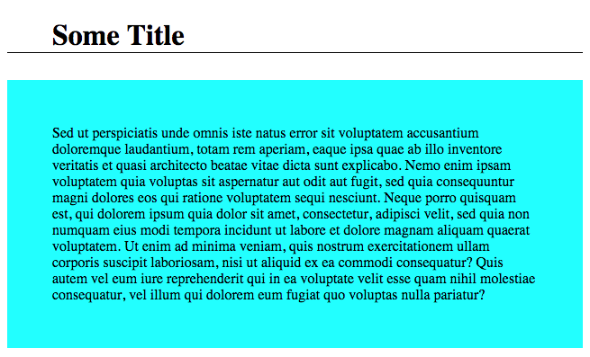

### Block, inline, inline-block

The `display` property has three possible values: `inline`, `block`, and `inline-block`:

**Inline**
- `width` and `height` cannot be set
- Allows other elements to sit to their left and right
- `padding` and `margin` can be set for the left and rigth but not bottom or top

**Block**
- Forces a line break after the block element
- `width`, `height`, `margin`, and `padding` can all be set

**Inline-block**
- Allows other elements to sit to their left and right
- `width`, `height`, `margin`, and `padding` can all be set

> **Exercise:** Take the quote below and stylize every instance of the word "information". Create a line break as in the quote. Here is an example:
>
> 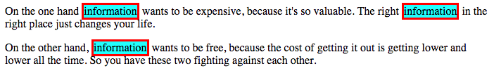
>
> *"On the one hand information wants to be expensive, because it's so valuable. The right information in the right place just changes your life.*
>
> *"On the other hand, information wants to be free, because the cost of getting it out is getting lower and lower all the time. So you have these two fighting against each other."*

### Positioning

**Position**
- `static`: position element in order, in document flow (cannot set `top`, `bottom`, `left,` or `right`)
  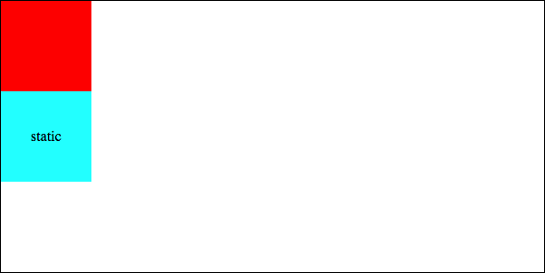

- `relative`: position the element relative to its default position
  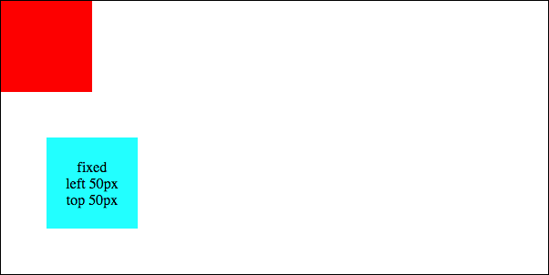

- `absolute`: position element relative to top-left of page
  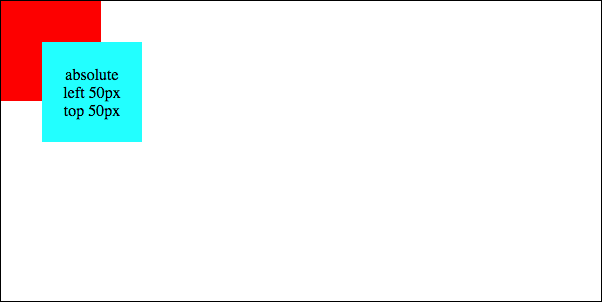

- `fixed`: position element in a fixed location on page
  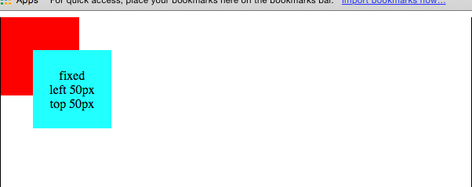
  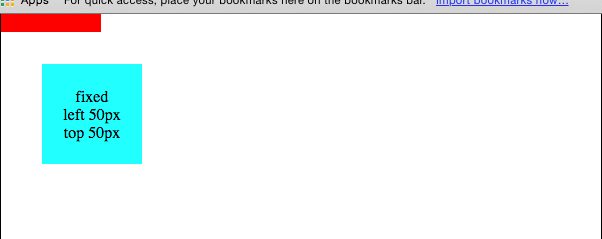

> **Exercise:** Create a fixed navigation bar. See this example:
>
> 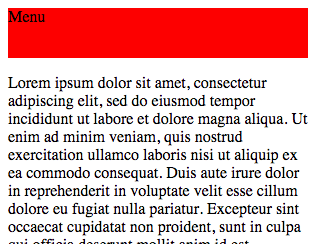
>
> 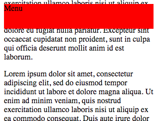

#### Float and clear

**Float**
- `left`: float element left
- `right`: float element right

**Clear**
- `left`: clears a left float
- `right`: clears a right flow
- `both`: clears both

> **Exercise:** Create a page with four sections: two horizontal sections with two equal-width sections in between. See the example below. Don't use a `table` tag. Use `float` and `clear`.
>
> 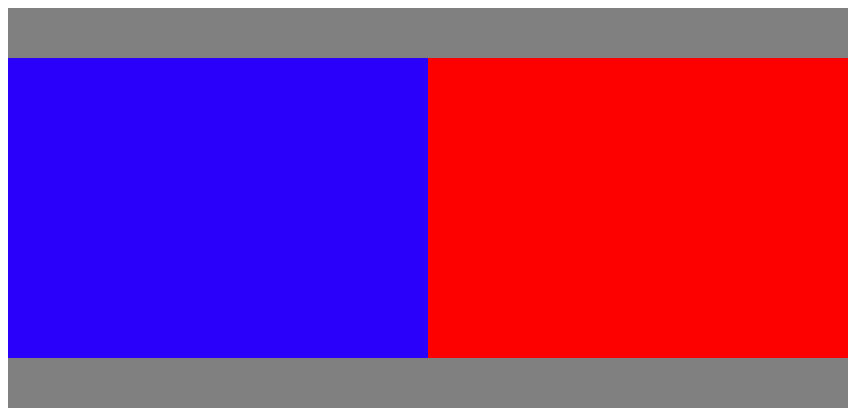

### Custom fonts

[Google Fonts](https://www.google.com/fonts) are a great online resource for adding custom fonts to your web pages. Just copy and paste the `link` tag provided on the "Quick use" page. For example:

`<link href='http://fonts.googleapis.com/css?family=Roboto+Slab' rel='stylesheet' type='text/css'>`

# In-class, team assignment

Work in teams of four to build a small, static HTML and CSS weather app. Use [index.html](weather-app/index.html) as a starting point to build a simple weather application. Work with your teammates to design the app and then each person must execute a different section: morning, day, evening, night. We have provided [an example](weather-app/example). This is for inspiration and a starting point, but you need--and should not--simply copy it.

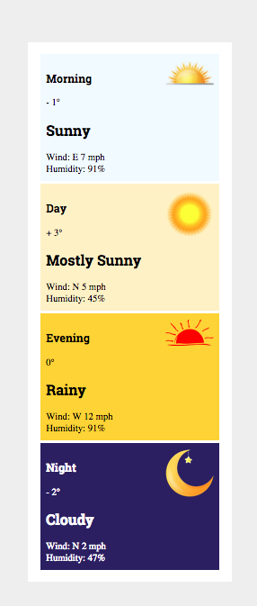


# Homework assignment
[See here.](assignment.md)
